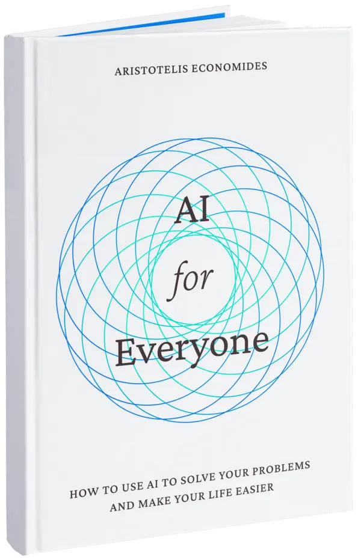

<h1 align="center">
   
  </img>
   
  AI for Everyone
   
</h1>

<h4 align="center">A practical guide for making AI useful in daily life: real-world problems, tasks, or just for fun.</h4>

  
  

  <a href="#whats-inside">What's Inside</a> •
  <a href="#why-free">Why Free</a> •
  <a href="#download">Download</a> •
  <a href="#support">Support</a> •
  <a href="#license">License</a>

  

## What's inside?

- How language models actually work, in simple words.
- How neural networks do math with text: tokenization, and encoding.
- What is context window and how it affects your conversations.
- Prompt engineering techniques for getting consistently useful results.
- How to use language models with the APIs, without a $20/month subscription.
- Choose the best AI tools for your needs.
- Ways to create specialized AI assistants.
- Lots of prompt examples for different tasks.

## Why free?

Most AI content today is too technical, superficial, or scattered over the internet. I believe everyone should understand AI and know how to make it useful for them. That's why this handbook is completely free and open.

## Download

You can download the latest version of the ebook at [aristot.io/ai4e](https://aristot.io/ai4e), or directly from the [releases page](https://github.com/intergalacticmammoth/ai-for-everyone/releases).

## Support

Or

## License

Book: [Creative Commons BY 4.0](https://creativecommons.org/licenses/by/4.0/). You are free to share, adapt, and use this work for any purpose, even commercially, as long as you give [proper attribution](https://wiki.creativecommons.org/wiki/Recommended_practices_for_attribution).

Site: [MIT](./LICENSE).

---

> 🌐 [aristot.io](https://aristot.io) &nbsp;&middot;&nbsp;
> 𝕏 [@aristot_3rd](https://x.com/aristot_3rd)
